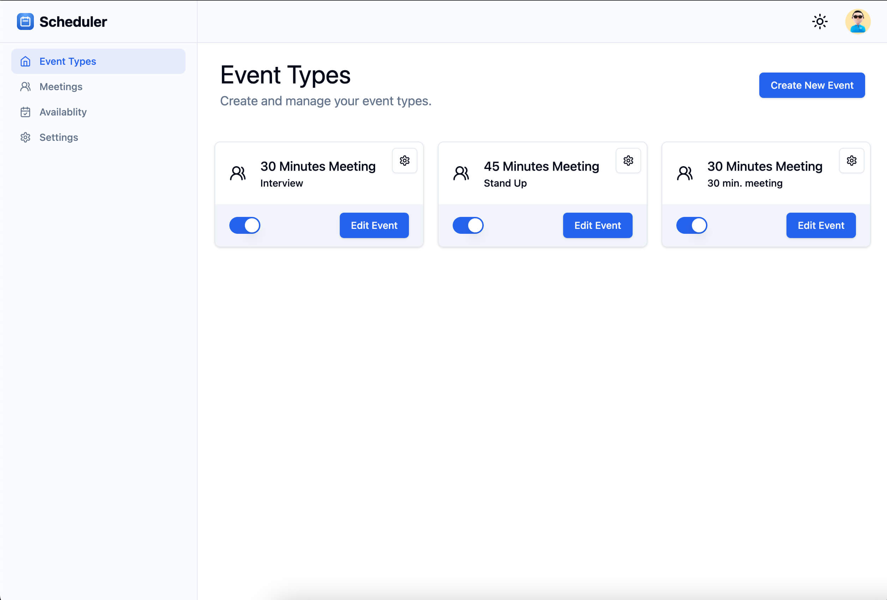
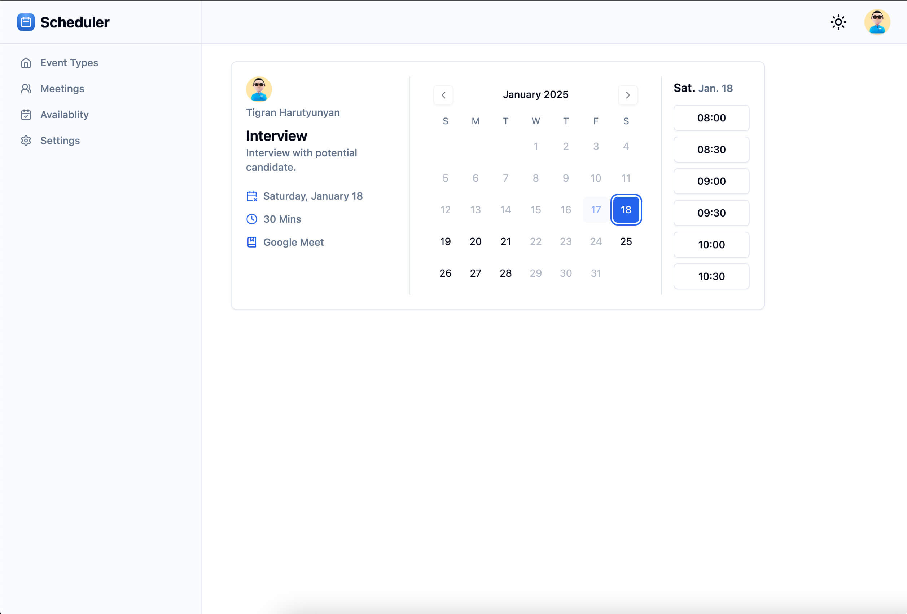
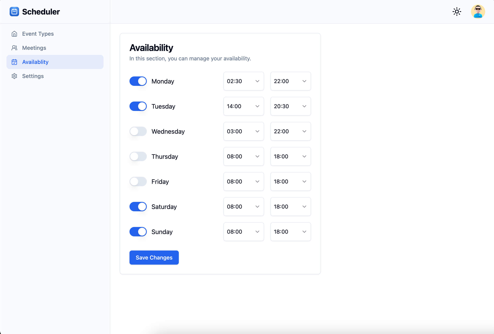

# Fullstack Scheduler application with Nuxt.js, Supabase, Nylas, Tailwind, Shadcn

[Live Demo](https://scheduler-nuxt.vercel.app)

[Video Demo](https://shorturl.at/vmNtu)

Features:

- Tailwind design
- Full responsiveness
- Supabase Authentication with gmail
- Client form validation and handling using vee validate
- Shadcn component library
- Retrieve and manage calendars and events to build scheduling automation, calendar management, and other scheduling experiences with Nylas
- Setup the availability
- Create, Edit, delete, preview Event Types.
- Create meeetings based on availibility and event type.

